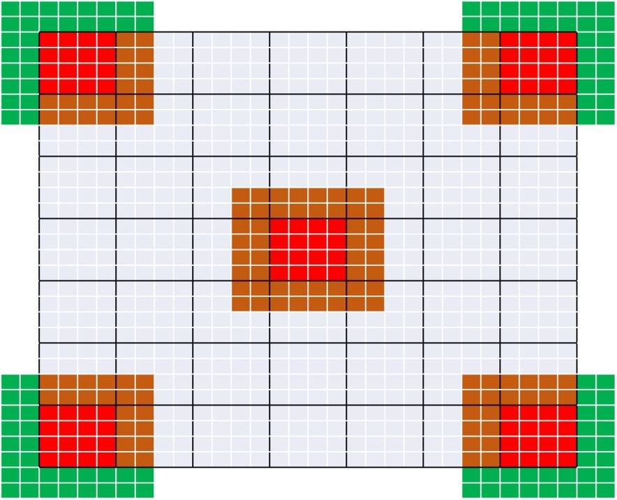
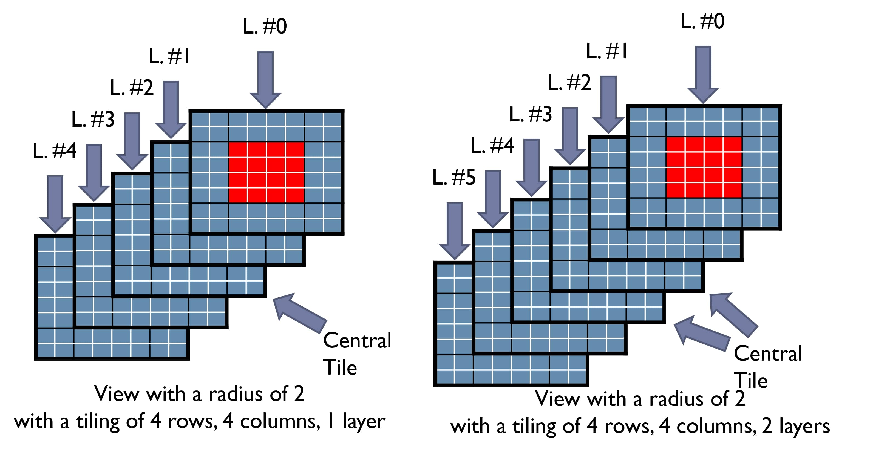
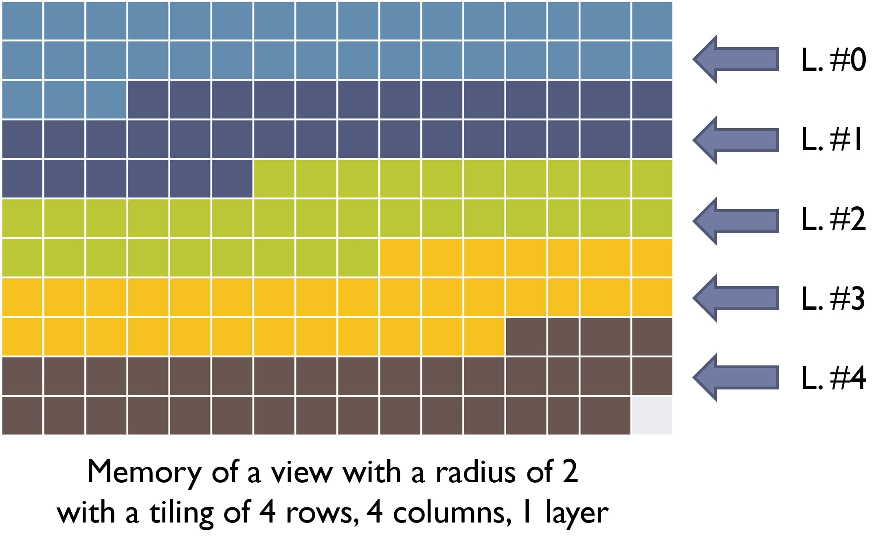
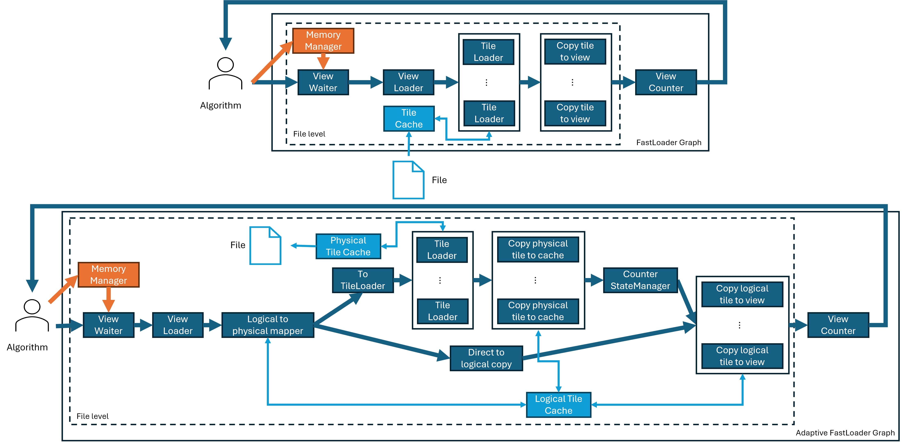

# Fast Loader (FL) : A High-Performance Accessor for Loading N-Dimensional (tiled) files

An application programming interface to access large files, such as images.

The API presents these images as views (sub-regions) that are streamed as soon as a region is loaded. 
Algorithms can then process these views in parallel to overlap loading from disk with CPU/GPU computation. 
FastLoader's approach attempts to maximize bandwidth through its parallelism and caching mechanisms.

## Content

- [Installation Instructions]
    - [Dependencies]
    - [Building Fast Loader]
- [Motivation]
- [Approach]
- [Architecture]
- [Steps to Programming with Fast Loader]
    - [Linking Fast Loader]
    - [API overview]
    - [How to create a Tile Loader ? How to access a specific file ?]
    - [Getting started]
- [Credits]
- [Contact Us]

# Installation Instructions

## Dependencies

1) C++20 compiler (tested with gcc 11.1+, clang 10, and MSVC 14.33)

2) Hedgehog v.3 + (https://github.com/usnistgov/hedgehog)

3) LibTIFF (http://www.simplesystems.org/libtiff/) [optional / TIFF support]

4) doxygen (www.doxygen.org/) [optional / Documentation]

## Building Fast Loader
**CMake Options:**

TEST_FAST_LOADER - Compiles and runs google unit tests for Fast Loader ('make run-test' to re-run)

```
 :$ cd <FastLoader_Directory>
 :<FastLoader_Directory>$ mkdir build && cd build
 :<FastLoader_Directory>/build$ ccmake ../ (or cmake-gui)

 'Configure' and setup cmake parameters
 'Configure' and 'Build'

 :<FastLoader_Directory>/build$ make
```

# Motivation

The hardware landscape for high-performance computing currently
features compute nodes with a high degree of parallelism within a node
(e.g., 46 cores for the newly-announced Qualcomm Centriq CPU, 32
physical cores for the AMD Epyc CPU, and 24 logical cores for an Intel
Xeon Skylake CPU), that increases with every new hardware generation.
By contrast, the amount of memory available per core is not increasing
in a commensurate manner and may even be decreasing especially when
considered on a per-core basis. Furthermore, while the computational
capacity of these systems keeps on improving, their programmability
remains quite challenging. As such, designing image processing
algorithms to minimize memory usage is a key strategy to taking
advantage of this parallelism and support concurrent users or the
multithreaded processing to large files.

# Approach

_Fast Loader_ improves programmer productivity by providing high-level
abstractions, _View_ and _Tile_, along with routines that build on
these abstractions to operate across entire files without actually
loading it in memory. The library operates on tiles with
possibly a halo of pixels around an individual tile. _Fast Loader_
only loads a small number of tiles to maintain a low-memory footprint
and manages an in-memory cache. Furthermore, the library takes
advantage of multicore computing by offloading tiles to compute
threads as soon as they become available. This allows for multiple
users to maintain high throughput, while processing several images or
views concurrently.

# Key concepts

## Tile

The following picture represents an image divided into _tiles_. Each gray squares represent a pixel.
A contiguous ND group of pixels is named a _tile_ (surrounded by a black border in the image). 



## View
A _View_ is a tile augmented by a halo of pixels around it in every dimension.
These _Views_ are then composed by a _central tile_ (in red) and ghost values in green and brown.
The green values need to be created, by default, _FastLoader_ uses the values that already are in the buffer. 
Another _Border Creator_ available fills these values with a constant. (An API exists to create user-defined 
_Border Creator_). The brown values are taken by the surrounding _tiles_.

## View memory layout
_Images_ and _views_ have their dimensions ordered from the least to the most dense. 
If the image is using multiple channels (RGB images for example), the channel number is considered a dimension.  
In the following _image_ the dimensions, in order, are depth (number of layers), height (number of rows), and width (number of columns).
By default, the _radii_ (halo size) are applied to **all dimensions** (including the depth and the channels). 
It is possible to define the _radius_ per dimension.

This image shows memory layout for two views that have the same height and width but different depth size. 



In memory, the data is stored contiguously from the least to the most dense, in this example, depth, height, and width.



In terms of performance, if the last dimensions has a size of 1 (if we consider the channel number in a grayscale 
image for example), it is better to not declare this dimension. 
A planar grayscale is better considered as a 2D image than a 3D image performance wise. 
The last dimension size is the unit-size of the copies between buffers in _FastLoader_ to create the _tiles_ and _views_. 

# Architecture

_Fast Loader_ architecture shows how the system work and interact with
the algorithm. First of all it works asynchronously from the
algorithm. Secondly each part of Fast Loader will be on different
threads. Finally, the memory manager guaranties that the amount
of memory will be limited as asked.

When an algorithm will ask _n_ views through _View Request_. _Fast
Loader_ will use this _View Request_ to build a _view_ and make it
available as soon as possible. The algorithm will then be able to use it
(and release it). In the meantime, if enough memory is available another _view_ will be created.

The _View_ creation go through 3 steps:
1. _View Loader_: Request memory from the memory manager and split the
   _View Request_, to _n_ _Tile Loader_ and send them to the _Tile
   Loader_.
2. _Tile Loader_: Specific to the file _Fast Loader_ access to. Will
   ask the _Tile_ to _Tile Cache_, if it not available the _Tile_ will be
   loaded from the file, then cast and copy to the _Tile Cache_. From the
   cache only the interesting _Tile_'s part will be copied to the _View_.
3. _View Counter_: Wait for the _view_ to be fully loaded from file's
   parts. Then build the ghost region if needed, and send the complete
   _view_ to the algorithm.

The number of _View_ created at a point in time by _FastLoader_ is managed by the _ViewWaiter_. It is attached to a 
memory manager which throttles the number of views produced.

Following the Fast Loader Graph and its interaction with the algorithm:



The _Adaptive FastLoader_ graph follows the same logic as the _FastLoader_ graph while providing an added feature.
The file as a *physical* structure. Its tiling is defined. The _Adaptive FastLoader_ allows to request _Views_ from the 
file but following another tiling size, called _logical size_.
Another cache is used to store logical tiles temporarily. It avoids extra unnecessary access to the file. 

# Steps to Programming with Fast Loader

## Linking _Fast Loader_

_Fast Loader_ can be easily linked to any C++ 20 compliant code using
cmake. Add the path to the folder
FastImageDirectory/cmake-modules/ to the CMAKE_MODULE_PATH variable in your CMakeLists.txt.
Then add the following lines in your CMakeLists.txt:
```cmake
find_package(FastLoader REQUIRED)
target_link_libraries(TARGET ${FastLoader_LIBRARIES} ${Hedgehog_LIBRARIES})
target_include_directories(TARGET PUBLIC ${FastLoader_INCLUDE_DIR} ${Hedgehog_INCLUDE_DIR})
```

## API overview

3 API exists in _Fast Loader_:
1. The _[Adaptive]FastLoaderGraph_ object to access views of an image
2. The _View_ object to access pixel/data in the _View_
3. Tile Loader

## How to create a Tile Loader ? How to access a specific file ?

To access to a new file format, a specific _Tile Loader_ is needed. A specific _Tile Loader_ class will inherit from the
class _AbstractTileLoader_.

The following methods need to be implemented:
```cpp
  // Constructor
  AbstractTileLoader(std::string const &name, std::filesystem::path filePath, size_t const nbThreads = 1)

  // Copy function to duplicate the Tile Loader into n threads 
  virtual std::shared_ptr<AbstractTileLoader> copyTileLoader() = 0;
  
  // Basic file information getter 
  [[nodiscard]] virtual size_t nbDims() const = 0;
  [[nodiscard]] virtual size_t nbPyramidLevels() const = 0;
  [[nodiscard]] virtual std::vector<std::string> const &dimNames() const = 0;
  [[nodiscard]] virtual std::vector<size_t> const &fullDims([[maybe_unused]] std::size_t level) const = 0;
  [[nodiscard]] virtual std::vector<size_t> const &tileDims([[maybe_unused]] std::size_t level) const = 0;
  
  float downScaleFactor([[maybe_unused]] uint32_t level) [optional]
  
  // Load a specific tile from the file, the tile has already allocated.
  virtual void loadTileFromFile(std::shared_ptr<std::vector<DataType>> tile, std::vector<size_t> const &index, size_t level) = 0;
```

Here is an example Tile Loader for Grayscale Tiled 2D Tiff:

```cpp
#include <tiffio.h>
#include "fast_loader/fast_loader.h"

template<class DataType>
class GrayscaleTiffTileLoader : public fl::AbstractTileLoader<fl::DefaultView<DataType>> {
  TIFF *
      tiff_ = nullptr;             ///< Tiff file pointer

  std::vector<size_t>
      fullDims_{},                ///< File dimensions to the least to most dense
      tileDims_{};                ///< Tile dimensions to the least to most dense

  std::vector<std::string>
      dimNames_{};                ///< Dimensions name to the least to most dense

  short
      sampleFormat_ = 0,          ///< Sample format as defined by libtiff
      bitsPerSample_ = 0;         ///< Bit Per Sample as defined by libtiff

 public:

  /// @brief GrayscaleTiffTileLoader unique constructor
  /// @param numberThreads Number of threads associated
  /// @param filePath Path of tiff file
  GrayscaleTiffTileLoader(size_t numberThreads, std::string const &filePath)
      : fl::AbstractTileLoader<fl::DefaultView<DataType>>("GrayscaleTiffTileLoader", filePath, numberThreads ) {
    short samplesPerPixel = 0;

    // Open the file
    tiff_ = TIFFOpen(filePath.c_str(), "r");
    if (tiff_ != nullptr) {
      if (TIFFIsTiled(tiff_) == 0) { throw (std::runtime_error("Tile Loader ERROR: The file is not tiled.")); }


      uint32_t
          fullHeight = 0,           ///< Full height in pixel
          fullWidth = 0,            ///< Full width in pixel
          tileHeight = 0,           ///< Tile height
          tileWidth = 0;            ///< Tile width

      // Load/parse header
      TIFFGetField(tiff_, TIFFTAG_IMAGEWIDTH, &fullWidth);
      TIFFGetField(tiff_, TIFFTAG_IMAGELENGTH, &fullHeight);
      TIFFGetField(tiff_, TIFFTAG_TILEWIDTH, &tileWidth);
      TIFFGetField(tiff_, TIFFTAG_TILELENGTH, &tileHeight);
      TIFFGetField(tiff_, TIFFTAG_SAMPLESPERPIXEL, &samplesPerPixel);
      TIFFGetField(tiff_, TIFFTAG_BITSPERSAMPLE, &(this->bitsPerSample_));
      TIFFGetField(tiff_, TIFFTAG_SAMPLEFORMAT, &(this->sampleFormat_));

      fullDims_ = {fullHeight, fullWidth};
      tileDims_ = {tileHeight, tileWidth};
      dimNames_ = {"Height", "Width"};

      // Test if the file is greyscale
      if (samplesPerPixel != 1) {
        std::stringstream message;
        message << "Tile Loader ERROR: The file is not greyscale: SamplesPerPixel = " << samplesPerPixel << ".";
        throw (std::runtime_error(message.str()));
      }
      // Interpret undefined data format as unsigned integer data
      if (sampleFormat_ < 1 || sampleFormat_ > 3) { sampleFormat_ = 1; }
    } else { throw (std::runtime_error("Tile Loader ERROR: The file can not be opened.")); }
  }

  /// @brief GrayscaleTiffTileLoader destructor
  ~GrayscaleTiffTileLoader() override {
    if (tiff_) {
      TIFFClose(tiff_);
      tiff_ = nullptr;
    }
  }

/// @brief Copy Method for the GrayscaleTiffTileLoader
/// @return Return a copy of the current GrayscaleTiffTileLoader
  std::shared_ptr<fl::AbstractTileLoader<fl::DefaultView<DataType>>> copyTileLoader() override {
    return std::make_shared<GrayscaleTiffTileLoader<DataType>>(this->numberThreads(), this->filePath());
  }


  /// @brief Load a tile from the file
  /// @param tile Buffer to fill (already allocated)
  /// @param index Tile index
  /// @param level Tile level (unused)
  void loadTileFromFile(std::shared_ptr<std::vector<DataType>> tile,
                        std::vector<size_t> const &index,
                        [[maybe_unused]]size_t level) override {
    tdata_t tiffTile = nullptr;
    tiffTile = _TIFFmalloc(TIFFTileSize(tiff_));
    TIFFReadTile(tiff_, tiffTile, uint32_t(index.at(1) * tileDims_.at(1)), uint32_t(index.at(0) * tileDims_.at(0)), 0, 0);
    std::stringstream message;
    switch (sampleFormat_) {
      case 1 :
        switch (bitsPerSample_) {
          case 8:loadTile<uint8_t>(tiffTile, tile);
            break;
          case 16:loadTile<uint16_t>(tiffTile, tile);
            break;
          case 32:loadTile<uint32_t>(tiffTile, tile);
            break;
          case 64:loadTile<uint64_t>(tiffTile, tile);
            break;
          default:
            message
                << "Tile Loader ERROR: The data format is not supported for unsigned integer, number bits per pixel = "
                << bitsPerSample_;
            throw (std::runtime_error(message.str()));
        }
        break;
      case 2:
        switch (bitsPerSample_) {
          case 8:loadTile<int8_t>(tiffTile, tile);
            break;
          case 16:loadTile<int16_t>(tiffTile, tile);
            break;
          case 32:loadTile<int32_t>(tiffTile, tile);
            break;
          case 64:loadTile<int64_t>(tiffTile, tile);
            break;
          default:
            message
                << "Tile Loader ERROR: The data format is not supported for signed integer, number bits per pixel = "
                << bitsPerSample_;
            throw (std::runtime_error(message.str()));
        }
        break;
      case 3:
        switch (bitsPerSample_) {
          case 8:
          case 16:
          case 32:loadTile<float>(tiffTile, tile);
            break;
          case 64:loadTile<double>(tiffTile, tile);
            break;
          default:
            message
                << "Tile Loader ERROR: The data format is not supported for float, number bits per pixel = "
                << bitsPerSample_;
            throw (std::runtime_error(message.str()));
        }
        break;
      default:message << "Tile Loader ERROR: The data format is not supported, sample format = " << sampleFormat_;
        throw (std::runtime_error(message.str()));
    }

    _TIFFfree(tiffTile);
  }

  /// @brief Number of file/tile dimensions 
  /// @details We consider only planar 2D grayscale images. So the two dimensions are the height and width. 
  /// If we were to open this loader to RGB images, the number of channels would be a third dimension.
  /// @return 2
  [[nodiscard]] size_t nbDims() const override { return 2; }

  /// @brief Pyramidal level accessor
  /// @return 1
  [[nodiscard]] size_t nbPyramidLevels() const override { return 1; }

  /// @brief Dimensions of the file, from the least to the most dense (Height, Width)
  /// @param level Pyramidal level (unused)
  /// @return A reference to the dimensions of the file, from the least to the most dense (Height, Width)
  [[nodiscard]] std::vector<size_t> const &fullDims([[maybe_unused]]std::size_t level) const override {
    return fullDims_;
  }

  /// @brief Dimensions of the tile, from the least to the most dense (Height, Width)
  /// @param level Pyramidal level (unused)
  /// @return A reference to the dimensions of the tile, from the least to the most dense (Height, Width)
  [[nodiscard]] std::vector<size_t> const &tileDims([[maybe_unused]]std::size_t level) const override {
    return tileDims_;
  }
  
  /// @brief Dimensions name from the least to the most dense (Height, Width)
  /// @return A reference to the dimensions name from the least to the most dense (Height, Width)
  [[nodiscard]] std::vector<std::string> const &dimNames() const override {
    return dimNames_;
  }

 private:
/// @brief Private function to cast and copy the values between the buffer from libtiff and the view
/// @tparam FileType Type inside the file
/// @param src Piece of memory coming from libtiff
/// @param dest Piece of memory to fill
  template<typename FileType>
  void loadTile(tdata_t src, std::shared_ptr<std::vector<DataType>> &dest) {
    static uint32_t tileSize = uint32_t(tileDims_.at(0) * tileDims_.at(1));
    for (uint32_t i = 0; i < tileSize; ++i) { dest->data()[i] = (DataType) ((FileType *) (src))[i]; }
  }

};
```

## Getting started

### Image Access

#### Access matching file structure

Here is a little program to go through all the views in a 2D TIFF tiled grayscale image:
```cpp
  size_t numberThreads = 2;

  // Instantiate a Tile loader
  auto tl = std::make_shared<GrayscaleTiffTileLoader<pixelType>>(numberThreads, "path_to_my_image.tiff");
  // Create the Fast Loader configuration
  auto config = std::make_unique<fl::FastLoaderConfiguration<fl::DefaultView<pixelType>>>(tl);
  // Set the configuration
  config->ordered(true);
  // Create the Fast Loader Graph
  auto fl = fl::FastLoaderGraph<fl::DefaultView<pixelType>>(std::move(config));

  // Execute the graph
  fl.executeGraph();
  // Request all the views in the graph
  fl.requestAllViews();
  // Indicate no other view will be requested
  fl.finishRequestingViews();

  // For each of the result
  while (auto viewVariant = fl.getBlockingResult()) {
      // Get the actual view out of the variant
      auto view = std::get<std::shared_ptr<fl::DefaultView<pixelType>>>(*viewVariant);
      // Do things with the view

      // Return the view to the Fast Loader Graph
      view->returnToMemoryManager();
  }

  // Wait for the graph to terminate
  fl.waitForTermination();
```

To request only a subset of views, the method 
```cpp
void requestView(std::vector<size_t> const &indexCentralTile, size_t level = 0)
```
can be invoked instead of: 
```cpp
void requestAllViews(size_t level = 0)
```

However, the loop based approach to get result with single request\[s\] deadlocks: 
```cpp
  fl.requestView({0,0});

  while (auto viewVariant = fl.getBlockingResult()) {
    // Get the actual view out of the variant
    auto view = std::get<std::shared_ptr<fl::DefaultView<pixelType>>>(*viewVariant);
    // Do things with the view
    
    // Return the view to the Fast Loader Graph
    view->returnToMemoryManager();
  }
```

*auto getBlockingResult();* only returns void if *fl.finishRequestingViews();* has been invoked beforehand.

A solution could be:
```cpp
  fl.requestView({0,0});
  fl.requestView({0,1});
  fl.requestView({0,2});

  for (int i = 0; i < 3; ++i) {
        // Get the actual view out of the variant
        auto view = std::get<std::shared_ptr<fl::DefaultView<pixelType>>>(*(fl.getBlockingResult()));
        // Do things with the view
        // Return the view to the Fast Loader Graph
        view->returnToMemoryManager();
  }

  fl.requestView({1,0});
  fl.requestView({1,1});
  
  for (int j = 0; j < 2; ++j) {
        // Get the actual view out of the variant
        auto view = std::get<std::shared_ptr<fl::DefaultView<pixelType>>>(*(fl.getBlockingResult()));
        // Do things with the view
        // Return the view to the Fast Loader Graph
        view->returnToMemoryManager();
  }
  // Indicate no other view will be requested
  fl.finishRequestingViews();
  // Wait for the graph to terminate
  fl.waitForTermination();
```

#### Adaptive file access

If the end-user algorithm needs a structure different from the file structure, another graph type can be used, the *AdaptiveFastLoaderGraph*. 
It is used exactly as the *FastLoaderGraph*.
To construct one, the following constructor is used: 
```cpp
  /// @brief Adaptive Fast Loader graph constructor
  /// @param configuration Fast Loader graph configuration
  /// @param logicalTileDimensionRequestedPerDimensionPerLevel Dimensions of the tiles for all levels {{d00, ..., d0n}, ..., {dm0, ..., dmn}} for n dimensions tiles with m levels
  /// @param logicalTileCacheMBPerLevel Cache size in MB used  for the transformation between physical tiles to requested tiles for every level
  /// @param nbThreadsCopyLogicalCacheView Number of threads associated with the copy from the logical cache to view task
  /// @param name Fast Loader graph name
  AdaptiveFastLoaderGraph(
      std::unique_ptr<FastLoaderConfiguration<ViewType>> configuration,
      std::vector<std::vector<size_t>> const &logicalTileDimensionRequestedPerDimensionPerLevel,
      std::vector<size_t> logicalTileCacheMBPerLevel = {},
      size_t nbThreadsCopyLogicalCacheView = 2,
      std::string const &name = "Adaptive Tile Loader")
      : fl::FastLoaderGraph<ViewType>(name),
        logicalTileCacheMBPerLevel_(std::make_shared<std::vector<size_t>>(logicalTileCacheMBPerLevel)),
        logicalTileDimensionRequestedPerDimensionPerLevel_(logicalTileDimensionRequestedPerDimensionPerLevel) 
```


### Custom traversal

A custom traversal can be implemented by inheriting from *fl::AbstractTraversal*.
For reference the naive traversal is implemented as follows:
```c++
/// @brief Naive traversal traversing all dimensions in order
class NaiveTraversal : public AbstractTraversal {
 public:
  NaiveTraversal() : AbstractTraversal("Naive Traversal") {}
  ~NaiveTraversal() override = default;
  /// @brief Traversal getter
  /// @param nbTilesPerDimension Number of tiles per dimension
  /// @return Traversal {{i1, ..., j1}, {i1, ..., j2}, {i1, ..., j3} ....}
  [[nodiscard]] std::vector<std::vector<size_t>> traversal(std::vector<size_t> nbTilesPerDimension) const override {
    std::vector<std::vector<size_t>> traversal;
    generateTraversal(traversal, nbTilesPerDimension, {}, nbTilesPerDimension.size());
    return traversal;
  }

  /// @brief Create the traversal by traversing all dimensions in order
  /// @param traversal Returned traversal
  /// @param nbTilesPerDimension Number of tiles per dimension
  /// @param current Current position in the traversal
  /// @param nbDimensions Number of dimensions
  /// @param dimension Current dimension
  inline void generateTraversal(
      std::vector<std::vector<size_t>> &traversal,
      std::vector<size_t> const &nbTilesPerDimension,
      std::vector<size_t> current,
      size_t nbDimensions, size_t dimension = 0) const{
    if (dimension == nbDimensions - 1) {
      for (size_t pos = 0; pos < nbTilesPerDimension.at(dimension); ++pos) {
        current.push_back(pos);
        traversal.push_back(current);
        current.pop_back();
      }
    } else {
      for (size_t pos = 0; pos < nbTilesPerDimension.at(dimension); ++pos) {
        current.push_back(pos);
        generateTraversal(traversal, nbTilesPerDimension, current, nbDimensions, dimension + 1);
        current.pop_back();
      }
    }
  }
};
```

To use it, it needs to be passed as an option.

### Loading configuration
The sequence logic of: 
```cpp
// Instantiate a Tile loader
auto tl = std::make_shared<GrayscaleTiffTileLoader<pixelType>>(numberThreads, "path_to_my_image.tiff");
// Create the Fast Loader configuration
auto config = std::make_unique<fl::FastLoaderConfiguration<fl::DefaultView<pixelType>>>(tl);
// Set the configuration
config->ordered(true);
// Create the Fast Loader Graph
auto fl = fl::FastLoaderGraph<fl::DefaultView<pixelType>>(std::move(config));
```
is the following. The _TileLoader_, access the image and provides an interface to the file's metadata. 
_FastLoaderConfiguration_ uses these information to validate the user-defined configuration and customize the file access. 

Here is what is customizable:
- The radius
  - By calling radius(size_t sharedRadius) that define a common radius value among the dimensions
  - By calling radii(std::vector<size_t> const &radii) that set different radius value for the dimensions
- The cache capacity attached to the tie loader (cacheCapacityMB(vector<size_t> const &))
- If the views need to be given in the same order they have been requested or as soon as possible (ordered(bool))
- The release count for the views (number of time a view need to be returned before being clean for reuse) (releaseCountPerLevel(std::vector<size_t> const &))
- The number of views being constructed in parallel (viewAvailable(vector<size_t> const &))
- The traversal used if all views are requested (traversalType(TraversalType) / traversalCustom(shared_ptr<TraversalType>))
- The borderCreator used to fill the view with data not defined by the file (borderCreator(FillingType) / borderCreatorConstant(data_t) / borderCreatorCustom(shared_ptr<AbstractBorderCreator<ViewType>>))

### Loading configuration

# Credits

Alexandre Bardakoff

Timothy Blattner

Walid Keyrouz


# Contact Us

<a target="_blank" href="mailto:timothy.blattner@nist.gov">Timothy Blattner (timothy.blattner ( at ) nist.gov</a>
