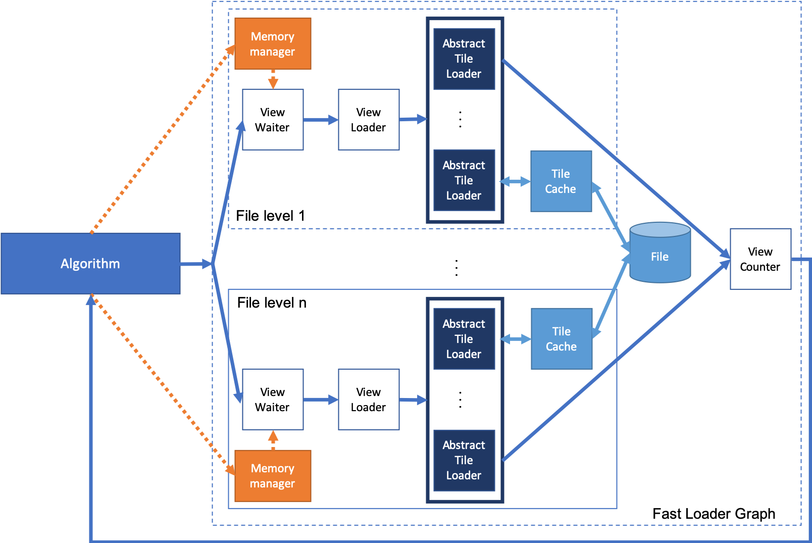

# Fast Loader (FL) : A High-Performance Accessor for Loading (tiled) files

An application programming interface to access large files, such as images.

The API presents these images as views (sub-regions) that are streamed as soon as a region is loaded. Algorithms can then process these views in parallel to overlap loading from disk with CPU computation. FastLoader's approach attempts to maximize bandwidth through its parallelism and caching mechanisms. 

## Content

- [Installation Instructions](#installation-instructions)
    - [Dependencies](#dependencies)
    - [Building Fast Loader](#building-fast-loader)
- [Motivation](#motivation)
- [Approach](#approach)
- [Architecture](#architecture)
- [Steps to Programming with Fast Loader](#steps-to-programming-with-fast-loader)
    - [Linking Fast Loader](#linking-_fast-loader_)
    - [API overview](#api-overview)
    - [How to create a Tile Loader ? How to access a specific file ?](#how-to-create-a-tile-loader-how-to-access-a-specific-file-)
    - [Getting started](#getting-started)
- [Credits](#credits)
- [Contact Us](#contact-us)

# Installation Instructions

## Dependencies

1) g++/gcc version 9+

2) Hedgehog v.1.1.0+ (https://github.com/usnistgov/hedgehog)

3) LibTIFF (http://www.simplesystems.org/libtiff/) [optional / TIFF support]

4) doxygen (www.doxygen.org/) [optional / Documentation]

## Building Fast Loader
**CMake Options:**

CMAKE_INSTALL_PREFIX - Where to install Fast Loader (and documentation)

BUILD_DOXYGEN - Creates doxygen documentation

RUN_GTEST - Compiles and runs google unit tests for Fast Loader ('make run-test' to re-run)

```
 :$ cd <FastLoader_Directory>
 :<FastLoader_Directory>$ mkdir build && cd build
 :<FastLoader_Directory>/build$ ccmake ../ (or cmake-gui)

 'Configure' and setup cmake parameters
 'Configure' and 'Build'

 :<FastLoader_Directory>/build$ make
 :<FastLoader_Directory>/build$ [sudo] make install
```

# Motivation

The hardware landscape for high-performance computing currently
features compute nodes with a high degree of parallelism within a node
(e.g., 46 cores for the newly-announced Qualcomm Centriq CPU, 32
physical cores for the AMD Epyc CPU, and 24 logical cores for an Intel
Xeon Skylake CPU), that increases with every new hardware generation.
By contrast, the amount of memory available per core is not increasing
in a commensurate manner and may even be decreasing especially when
considered on a per-core basis. Furthermore, while the computational
capacity of these systems keeps on improving, their programmability
remains quite challenging. As such, designing image processing
algorithms to minimize memory usage is a key strategy to taking
advantage of this parallelism and support concurrent users or the
multi-threaded processing to large files.

# Approach

_Fast Loader_ improves programmer productivity by providing high-level
abstractions, _View_ and _Tile_, along with routines that build on
these abstractions to operate across an entire files without actually
loading it in memory. The library operates on tiles (e.g., a
1024x1024 partial image out of a very large 100K x 100K image) with
possibly a halo of pixels around an individual tile. _Fast Loader_
only loads a small number of tiles to maintain a low-memory footprint
and manages an in-memory cache. Furthermore, the library takes
advantage of multi-core computing by offloading tiles to compute
threads as soon as they become available. This allows for multiple
users to maintain high throughput, while processing several images or
views concurrently.

# Architecture

_Fast Loader_ architecture shows how the system work and interact with
the algorithm. First of all it works asynchronously from the
algorithm. Secondly each part of Fast Loader will be on on different
threads. Finally the static memory manager guaranty that the amount
of memory will be limited as asked.

When an algorithm will ask _n_ views through _View Request_. _Fast
Loader_ will use this _View Request_ to build a _view_ and make it
available as soon as possible. The algorithm will be able to use it
(and release it). In the mean time, if enough memory is available an
other _view_ will be created.

The _View_ creation go through 3 steps:
1. _View Loader_: Request memory from the memory manager and split the
   _View Request_, to _n_ _Tile Loader_ and send them to the _Tile
   Loader_.
2. _Tile Loader_: Specific to the file _Fast Loader_ access to. Will
   ask the _Tile_ to _Tile Cache_, if it not available the _Tile_ will be
   loaded from the file, then cast and copy to the _Tile Cache_. From the
   cache only the interesting _Tile_'s part will be copied to the _View_.
3. _View Counter_: Wait to the _view_ to be fully loaded from file's
   parts. Then build the ghost region if needed, and send the complete
   _view_ to the algorithm.

Following the Fast Loader Graph and it's interaction with the algorithm:



# Steps to Programming with Fast Loader

## Linking _Fast Loader_

_Fast Loader_ can be easily linked to any C++ 17 compliant code using
cmake. Add the path to the folder
FastImageDirectory/cmake-modules/ to the CMAKE_MODULE_PATH variable in your CMakeLists.txt.
Then add the following lines in your CMakeLists.txt:
```cmake
find_package(FastLoader REQUIRED)
target_link_libraries(TARGET ${FastLoader_LIBRARIES} ${Hedgehog_LIBRARIES})
target_include_directories(TARGET PUBLIC ${FastLoader_INCLUDE_DIR} ${Hedgehog_INCLUDE_DIR})
```

## API overview

3 API exists in _Fast Loader_:
1. The _FastLoaderGraph_ object to access views of an image
2. The _View_ object to access pixel/data in the _View_
4. Tile Loader

## How to create a Tile Loader ? How to access a specific file ?

To access to a new file format, a specific _Tile Loader_ is needed. A
specific _Tile Loader_ class will inherit from the class
_AbstractTileLoader_.

The following methods need to be implemented:
```cpp
  // Constructor
  AbstractTileLoader(std::string_view const &name, std::string filePath)
  // or
  AbstractTileLoader(std::string_view const &name, size_t numberThreads, std::string filePath)

  // Copy function to duplicate the Tile Loader into n threads 
  virtual std::shared_ptr<AbstractTileLoader> copyTileLoader() = 0;
  
  // Basic file information getter 
  virtual uint32_t fullHeight(uint32_t level) const = 0;
  virtual uint32_t fullWidth(uint32_t level) const = 0;
  uint32_t tileWidth(uint32_t level) const = 0;
  uint32_t tileHeight(uint32_t level) const = 0;
  short bitsPerSample() const = 0;
  uint32_t numberPyramidLevels() const = 0;

  uint32_t fullDepth([[maybe_unused]] uint32_t level) const; [optional]
  uint32_t tileDepth([[maybe_unused]] uint32_t level) const; [optional]
  uint32_t numberChannels() const; [optional]
  float downScaleFactor([[maybe_unused]] uint32_t level) [optional]

  
  // Load a specific tile from the file, the tile has already allocated.
  void loadTileFromFile(std::shared_ptr<std::vector<DataType>> tile, uint32_t indexRowGlobalTile, uint32_t indexColGlobalTile, uint32_t indexLayerGlobalTile, uint32_t level) = 0;
```

Here is an example Tile Loader for Grayscale Tiled Tiff:

```cpp
template<class DataType>
 class GrayscaleTiffTileLoader : public fl::AbstractTileLoader<fl::DefaultView<DataType>> {
  TIFF *
      tiff_ = nullptr;             ///< Tiff file pointer

  uint32_t
      fullHeight_ = 0,           ///< Full height in pixel
      fullWidth_ = 0,            ///< Full width in pixel
      tileHeight_ = 0,            ///< Tile height
      tileWidth_ = 0;             ///< Tile width

  short
      sampleFormat_ = 0,          ///< Sample format as defined by libtiff
      bitsPerSample_ = 0;         ///< Bit Per Sample as defined by libtiff
 public:

  /// @brief GrayscaleTiffTileLoader unique constructor
  /// @param numberThreads Number of threads associated
  /// @param filePath Path of tiff file
  GrayscaleTiffTileLoader(size_t numberThreads, std::string const &filePath)
      : fl::AbstractTileLoader<fl::DefaultView<DataType>>("GrayscaleTiffTileLoader", numberThreads, filePath) {
    short samplesPerPixel = 0;

    // Open the file
    tiff_ = TIFFOpen(filePath.c_str(), "r");
    if (tiff_ != nullptr) {
      if (TIFFIsTiled(tiff_) == 0) { throw (std::runtime_error("Tile Loader ERROR: The file is not tiled.")); }
      // Load/parse header
      TIFFGetField(tiff_, TIFFTAG_IMAGEWIDTH, &(this->fullWidth_));
      TIFFGetField(tiff_, TIFFTAG_IMAGELENGTH, &(this->fullHeight_));
      TIFFGetField(tiff_, TIFFTAG_TILEWIDTH, &this->tileWidth_);
      TIFFGetField(tiff_, TIFFTAG_TILELENGTH, &this->tileHeight_);
      TIFFGetField(tiff_, TIFFTAG_SAMPLESPERPIXEL, &samplesPerPixel);
      TIFFGetField(tiff_, TIFFTAG_BITSPERSAMPLE, &(this->bitsPerSample_));
      TIFFGetField(tiff_, TIFFTAG_SAMPLEFORMAT, &(this->sampleFormat_));

      // Test if the file is greyscale
      if (samplesPerPixel != 1) {
        std::stringstream message;
        message << "Tile Loader ERROR: The file is not greyscale: SamplesPerPixel = " << samplesPerPixel << ".";
        throw (std::runtime_error(message.str()));
      }
      // Interpret undefined data format as unsigned integer data
      if (sampleFormat_ < 1 || sampleFormat_ > 3) { sampleFormat_ = 1; }
    } else { throw (std::runtime_error("Tile Loader ERROR: The file can not be opened.")); }
  }

  /// @brief GrayscaleTiffTileLoader destructor
  ~GrayscaleTiffTileLoader() override {
    if (tiff_) {
      TIFFClose(tiff_);
      tiff_ = nullptr;
    }
  }

  /// @brief Load a tiff tile from a view
  /// @param tile Tile to copy into
  /// @param indexRowGlobalTile Tile row index
  /// @param indexColGlobalTile Tile column index
  /// @param level Tile's level
  void loadTileFromFile(std::shared_ptr<std::vector<DataType>> tile,
                        uint32_t indexRowGlobalTile, uint32_t indexColGlobalTile,
                        [[maybe_unused]] uint32_t level) override {
    tdata_t tiffTile = nullptr;
    tiffTile = _TIFFmalloc(TIFFTileSize(tiff_));
    TIFFReadTile(tiff_, tiffTile, indexColGlobalTile * tileWidth_, indexRowGlobalTile * tileHeight_, 0, 0);
    std::stringstream message;
    switch (sampleFormat_) {
      case 1 :
        switch (bitsPerSample_) {
          case 8:loadTile<uint8_t>(tiffTile, tile);
            break;
          case 16:loadTile<uint16_t>(tiffTile, tile);
            break;
          case 32:loadTile<uint32_t>(tiffTile, tile);
            break;
          case 64:loadTile<uint64_t>(tiffTile, tile);
            break;
          default:
            message
                << "Tile Loader ERROR: The data format is not supported for unsigned integer, number bits per pixel = "
                << bitsPerSample_;
            throw (std::runtime_error(message.str()));
        }
        break;
      case 2:
        switch (bitsPerSample_) {
          case 8:loadTile<int8_t>(tiffTile, tile);
            break;
          case 16:loadTile<int16_t>(tiffTile, tile);
            break;
          case 32:loadTile<int32_t>(tiffTile, tile);
            break;
          case 64:loadTile<int64_t>(tiffTile, tile);
            break;
          default:
            message
                << "Tile Loader ERROR: The data format is not supported for signed integer, number bits per pixel = "
                << bitsPerSample_;
            throw (std::runtime_error(message.str()));
        }
        break;
      case 3:
        switch (bitsPerSample_) {
          case 8:
          case 16:
          case 32:
            loadTile<float>(tiffTile, tile);
            break;
          case 64:
            loadTile<double>(tiffTile, tile);
            break;
          default:
            message
                << "Tile Loader ERROR: The data format is not supported for float, number bits per pixel = "
                << bitsPerSample_;
            throw (std::runtime_error(message.str()));
        }
        break;
      default:message << "Tile Loader ERROR: The data format is not supported, sample format = " << sampleFormat_;
        throw (std::runtime_error(message.str()));
    }

    _TIFFfree(tiffTile);
  }

  /// @brief Copy Method for the GrayscaleTiffTileLoader
  /// @return Return a copy of the current GrayscaleTiffTileLoader
  std::shared_ptr<fl::AbstractTileLoader<fl::DefaultView<DataType>>> copyTileLoader() override {
    return std::make_shared<GrayscaleTiffTileLoader<DataType>>(this->numberThreads(), this->filePath());
  }

  /// @brief Tiff file height
  /// @param level Tiff level [not used]
  /// @return Full height
  [[nodiscard]] uint32_t fullHeight([[maybe_unused]] uint32_t level) const override { return fullHeight_; }
  /// @brief Tiff full width
  /// @param level Tiff level [not used]
  /// @return Full width
  [[nodiscard]] uint32_t fullWidth([[maybe_unused]] uint32_t level) const override { return fullWidth_; }
  /// @brief Tiff tile width
  /// @param level Tiff level [not used]
  /// @return Tile width
  [[nodiscard]] uint32_t tileWidth([[maybe_unused]] uint32_t level) const override { return tileWidth_; }
  /// @brief Tiff tile height
  /// @param level Tiff level [not used]
  /// @return Tile height
  [[nodiscard]] uint32_t tileHeight([[maybe_unused]] uint32_t level) const override { return tileHeight_; }
  /// @brief Tiff bits per sample
  /// @return Size of a sample in bits
  [[nodiscard]] short bitsPerSample() const override { return bitsPerSample_; }
  /// @brief Level accessor
  /// @return 1
  [[nodiscard]] uint32_t numberPyramidLevels() const override { return 1; }

 private:
  /// @brief Private function to copy and cast the values
  /// @tparam FileType Type inside the file
  /// @param src Piece of memory coming from libtiff
  /// @param dest Piece of memory to fill
  template<typename FileType>
  void loadTile(tdata_t src, std::shared_ptr<std::vector<DataType>> &dest) {
    for (uint32_t i = 0; i < tileHeight_ * tileWidth_; ++i) { dest->data()[i] = (DataType) ((FileType *) (src))[i]; }
  }

};
```

## Getting started
```diff
The code in this section is only PSEUDOCODE, and is not meant to be executed as is.
```

### Image traversal

Here a little program to go through all the viewa in a virtual image:
```cpp
  // Instanciate a Tile loader
  auto tl = std::make_shared<VirtualFileTileChannelLoader>(
      numberThreads,
      fileHeight, fileWidth, fileDepth,
      tileHeight, tileWidth, tileDepth,
      numberChannels);

  // Create the Fast Loader configuration
  auto options = std::make_unique<fl::FastLoaderConfiguration<fl::DefaultView<int>>>(tl);
  // Set the configuration
  options->radius(radiusDepth, radiusHeight, radiusWidth);
  options->ordered(true);
  options->borderCreatorConstant(0);

  // Create the Fast Loader Graph
  auto fl = fl::FastLoaderGraph<fl::DefaultView<int >>(std::move(options));
  // Execute the graph
  fl.executeGraph();
  // Request all the views in the graph
  fl.requestAllViews();
  // Indicate no other view will be requested
  fl.finishRequestingViews();

  // For each of the view
  while (auto view = fl.getBlockingResult()) {
    // Do stuff

    // Return the view to the Fast Loader Graph
    view->returnToMemoryManager();
  }
  // Wait for the graph to terminate
  fl.waitForTermination();

```

# Credits

Alexandre Bardakoff

Timothy Blattner

Walid Keyrouz


# Contact Us

<a target="_blank" href="mailto:alexandre.bardakoff@nist.gov">Alexandre Bardakoff (alexandre.bardakoff ( at ) nist.gov</a>

<a target="_blank" href="mailto:timothy.blattner@nist.gov">Timothy Blattner (timothy.blattner ( at ) nist.gov</a>
